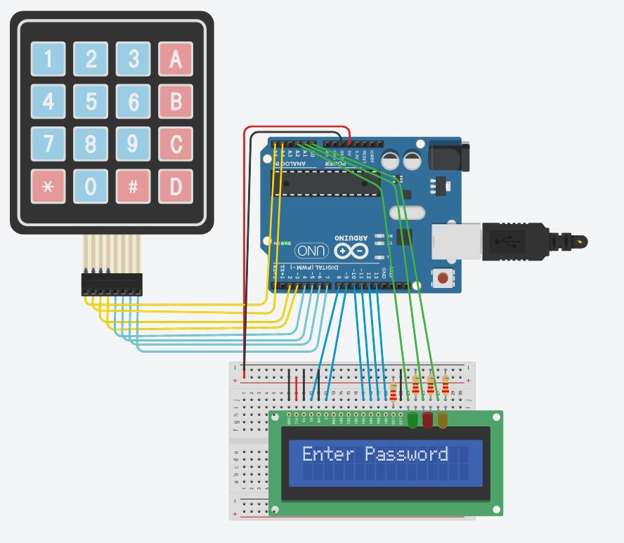

# Arduino-password

This is an Arduino Password circuit that enables the user to enter a password and test if it is entered correctly. The user is given a number of attempts that is changeable. If the user exceeds the maximum attempt,  the user is locked out of the circuit. The LEDs corresponds whether if the password is entered correctly or not: green LED represents password entered correctly; red LED represents password entered incorrectly; yellow LED represents locked out.

